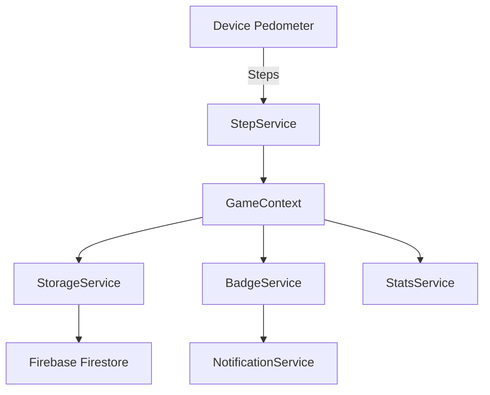

# Stridr - Functional Design Document

**Version:** 1.1  
**Last Updated:** January 15, 2026  
**Status:** Pre-Launch

---

## 1. Executive Summary

**Stridr** is a mobile fitness gamification application that transforms daily walking into virtual trekking adventures. Users track their real-world steps to virtually progress through iconic Indian Himalayan trails, unlocking landmarks, earning badges, and building healthy walking habits.

### Target Platforms
- **iOS** (iPhone/iPad)
- **Android**

### Core Value Proposition
Turn mundane daily walks into exciting virtual adventures exploring India's most beautiful trekking routes.

---

## 2. Application Architecture

### 2.1 Technology Stack

| Component | Technology |
|-----------|------------|
| Framework | Expo SDK 54 / React Native 0.81 |
| Language | TypeScript |
| Navigation | Expo Router (file-based) |
| State Management | React Context API |
| Local Storage | AsyncStorage |
| Cloud Storage | Firebase Firestore |
| Authentication | Firebase Auth (Email/Password) |
| Sensors | expo-sensors (Pedometer) |
| Notifications | expo-notifications |
| Background Tasks | expo-background-fetch, expo-task-manager |
| UI Icons | lucide-react-native |

### 2.2 Application Structure

```
├── app/                    # Screen components (Expo Router)
│   ├── (tabs)/             # Tab navigation screens
│   │   ├── index.tsx       # Home screen
│   │   ├── trails.tsx      # Trail selection
│   │   ├── progress.tsx    # Active trail progress
│   │   ├── achievements.tsx# Badge collection
│   │   └── profile.tsx     # User profile & settings
│   ├── trail/[id].tsx      # Trail detail screen
│   ├── login.tsx           # User authentication
│   ├── signup.tsx          # User registration
│   ├── my-dashboard.tsx    # User statistics dashboard
│   ├── edit-profile.tsx    # Profile editing
│   ├── notification-settings.tsx
│   └── legal.tsx           # Privacy policy & ToS
├── src/
│   ├── context/            # React Context providers
│   ├── services/           # Business logic services
│   ├── const/              # Static data (trails, badges)
│   ├── types/              # TypeScript interfaces
│   └── utils/              # Utility functions
```

---

## 3. Core Features

### 3.1 User Authentication

**Purpose:** Secure user account management with local-first data storage.

| Feature | Description |
|---------|-------------|
| Registration | First name, last name, email, password with validation |
| Login | Email/password authentication |
| Session Persistence | Auto-login via stored session token |
| Profile Updates | Edit name, email, profile photo |
| Account Deletion | GDPR-compliant full data removal |

> [!NOTE]
> Social authentication (Google/Facebook) deferred for initial launch; requires development build for production implementation.

---

### 3.2 Step Tracking System

**Purpose:** Track user's physical activity and convert steps to virtual trail distance.

#### How It Works
1. **Pedometer Integration** - Uses device's built-in motion sensors via `expo-sensors`
2. **Step Calculation** - Converts steps to distance using configurable stride length (default: 75cm)
3. **Sync Mechanism** - Automatically fetches steps since last sync
4. **Daily Logging** - Records daily step counts for historical tracking

#### Data Model

```typescript
interface UserProgress {
  selectedTrailId: string | null;
  trailStartDate: string | null;
  targetDays: number;
  totalStepsValid: number;
  currentDistanceMeters: number;
  lastSyncTime: string;
  completedTrails: CompletedTrail[];
  currentStreak: number;
  lastLogDate: string | null;
  stats: {
    totalStepsLifetime: number;
    totalDistanceMetersLifetime: number;
    completedTrailsCount: number;
  };
  monthlyProgress: MonthlyProgress;
  yearlyProgress: YearlyProgress[];
  trailBadges: string[];
}

interface MonthlyProgress {
  year: number;
  month: number;
  stepsThisMonth: number;
  distanceMetersThisMonth: number;
  unlockedBadgeIds: string[];
  monthlyBadgeEarned: boolean;
}
```

---

### 3.3 Virtual Trails

**Purpose:** Provide engaging virtual trekking experiences mapped to real Indian Himalayan trails.

#### Available Trails

**Incredible India Treks (15 trails)**

| Trail Name | Distance | Difficulty |
|------------|----------|------------|
| Roopkund Trek | 53 km | Hard |
| Chadar Trek | 65 km | Extreme |
| Kedarkantha Trek | 20 km | Easy |
| Valley of Flowers | 38 km | Moderate |
| Hampta Pass Trek | 26 km | Moderate |
| Goechala Trek | 90 km | Hard |
| Markha Valley Trek | 78 km | Hard |
| Pin Parvati Pass | 110 km | Extreme |
| Sandakphu Trek | 64 km | Moderate |
| Stok Kangri | 16 km | Extreme |
| Triund Trek | 9 km | Easy |
| Chembra Peak | 9 km | Moderate |
| Rajmachi Trek | 16 km | Easy |
| Dzükou Valley Trek | 20 km | Moderate |
| Kodachadri Trek | 20 km | Moderate |

**Classic Marathons (6 trails)**

| Trail Name | Distance | Difficulty |
|------------|----------|------------|
| 5K Challenge | 5 km | Easy |
| 10K Classic | 10 km | Moderate |
| Half Marathon | 21.1 km | Hard |
| Full Marathon | 42.2 km | Extreme |
| 50K Ultra | 50 km | Extreme |
| 100K Ultra | 100 km | Extreme |

**City Marathons (3 trails)**

| Trail Name | Distance | Difficulty |
|------------|----------|------------|
| Tokyo Marathon | 42.2 km | Hard |
| Boston Marathon | 42.2 km | Extreme |
| Berlin Marathon | 42.2 km | Hard |

#### Trail Data Structure

```typescript
interface Trail {
  id: string;
  name: string;
  description: string;
  extendedDescription?: string;
  totalDistanceMeters: number;
  image: any;
  color: string;
  difficulty: 'Easy' | 'Moderate' | 'Hard' | 'Extreme';
  landmarks: Landmark[];
  startCoordinate?: { latitude: number; longitude: number };
  endCoordinate?: { latitude: number; longitude: number };
  region?: { ... };
}

interface Landmark {
  id: string;
  name: string;
  distanceMeters: number;
  description: string;
  image?: any;
  coordinate?: { latitude: number; longitude: number };
}
```

---

### 3.4 Gamification System

#### 3.4.1 Monthly Badge System (Recurring)

Badges reset each month, encouraging continuous engagement:

| Collection | Focus | Badges |
|------------|-------|--------|
| 🏃 Walking Warriors | Monthly steps | 7 badges (5K to 500K steps) |
| 🗺️ Distance Destroyers | Monthly distance | 8 badges (5km to 200km) |
| 🏆 Monthly Master | 10/15 monthly badges | Named per month (e.g., "January Master") |
| 🎖️ Yearly Champion | All 12 monthly masters | Named per year (e.g., "2026 Champion") |
| 🏔️ Trail Blazers | Lifetime trail completions | 7 badges (1 to All trails) |

#### Monthly Step Badges

| Badge | Requirement |
|-------|-------------|
| First Steps | 5,000 steps |
| Getting Moving | 10,000 steps |
| Stride Master | 25,000 steps |
| Step Champion | 50,000 steps |
| Century Walker | 100,000 steps |
| Step Legend | 250,000 steps |
| Step Titan | 500,000 steps |

#### Monthly Distance Badges

| Badge | Requirement |
|-------|-------------|
| 5K Explorer | 5 km |
| 10K Traveler | 10 km |
| Half Marathon | 21 km |
| Marathon Master | 42 km |
| Ultra Runner | 50 km |
| Century Seeker | 100 km |
| Distance King | 150 km |
| Distance Demon | 200 km |

#### Badge Unlock Conditions

```typescript
interface Badge {
  id: string;
  name: string;
  description: string;
  icon: string; // Emoji
  conditionType: 'MONTHLY_STEPS' | 'MONTHLY_DISTANCE' | 'TRAILS_COMPLETED' | 'MONTHLY_MASTER' | 'YEARLY_CHAMPION';
  conditionValue: number;
  collection: string;
}
```

#### 3.4.2 Progress Tracking

- **Daily Goal** - Default 10,000 steps (configurable)
- **Weekly Activity Chart** - Visual 7-day step history
- **Trail Progress** - Percentage completion with landmark milestones
- **Streak System** - Consecutive days of meeting daily goal

---

### 3.5 Push Notifications

**Purpose:** Keep users engaged and motivated with timely notifications.

| Notification Type | When Triggered |
|------------------|----------------|
| Daily Reminder | Scheduled time (morning/afternoon/evening) |
| Goal Achievement | User reaches daily step goal |
| Badge Unlock | New badge earned |
| Milestone | 25%, 50%, 75% trail completion |
| Landmark Reached | User reaches a trail landmark |
| Inactivity Nudge | No activity for 2+ days |

#### Notification Settings Model

```typescript
interface NotificationSettings {
  dailyReminder: boolean;
  dailyReminderTime: 'morning' | 'afternoon' | 'evening';
  goalAchievement: boolean;
  badgeUnlock: boolean;
  milestone: boolean;
  inactivityNudge: boolean;
  landmarkReached: boolean;
}
```

---

### 3.6 User Dashboard

**Purpose:** Centralized view of personal statistics and achievements.

#### Dashboard Components
- **All-Time Statistics**
  - Total steps
  - Total distance (km/mi)
  - Total days active
  - Trails completed
  - Badges earned
  - Longest streak
  
- **Completed Trail Cards**
  - Trail image background
  - Completion date
  - Total steps/days
  - Average steps per day
  - Max steps in one day

---

## 4. Screen Specifications

### 4.1 Home Screen (`index.tsx`)

**Primary Purpose:** Dashboard overview and quick access to current activity.

| Section | Content |
|---------|---------|
| Header | Greeting with user name |
| Daily Goal Card | Circular progress, today's steps vs goal |
| Active Trail | Current trail progress with image, distance remaining |
| Weekly Activity | 7-day bar chart of steps |
| Your Accomplishments | Badge count, days active, total distance |
| Quick Start | Suggested trails for new users |

---

### 4.2 Trails Screen (`trails.tsx`)

**Primary Purpose:** Browse and select virtual trails.

| Section | Content |
|---------|---------|
| Trail List | Cards with name, difficulty, distance, landmarks |
| Favorites | Heart toggle to mark favorite trails |
| Coming Soon | Banner for upcoming trail additions |

---

### 4.3 Progress Screen (`progress.tsx`)

**Primary Purpose:** Detailed view of active trail progress.

| Section | Content |
|---------|---------|
| Trail Banner | Hero image with trail name overlay |
| Progress Bar | Visual completion percentage |
| Stats Row | Steps, distance, days on trail |
| Trail Activity Chart | Visual representation of progress over time |
| Landmarks Timeline | Vertical timeline showing unlocked/locked landmarks |

---

### 4.4 Achievements Screen (`achievements.tsx`)

**Primary Purpose:** Monthly badge progress and gamification rewards.

| Section | Content |
|---------|---------|
| Monthly Header | Current month, badges earned (X/15), progress to Monthly Master |
| Step Badges | Horizontal carousel with progress bars |
| Distance Badges | Horizontal carousel with progress bars |
| Trail Badges | Lifetime achievements section |
| Yearly Progress | Progress toward Yearly Champion |

---

### 4.5 Profile Screen (`profile.tsx`)

**Primary Purpose:** User settings and account management.

| Section | Content |
|---------|---------|
| Profile Header | Photo, name, edit button |
| Favorite Trails | Quick access to saved trails |
| Dashboard Link | Navigate to full statistics |
| Settings | Units, notifications, stride length |
| Legal | Privacy policy, terms of service |
| Account Actions | Logout, delete account |

---

## 5. User Preferences

### 5.1 Configurable Settings

| Setting | Options | Default |
|---------|---------|---------|
| Distance Unit | Kilometers / Miles | km |
| Theme | Light / Dark | Light |
| Daily Goal | Any number | 10,000 steps |
| Stride Length | Configurable (cm) | 75 cm |
| Notifications | Toggles per type | All enabled |
| Reminder Time | Morning/Afternoon/Evening | Morning (9 AM) |

---

## 6. Data Persistence

### 6.1 Cloud Storage (Firebase Firestore)

| Collection | Document | Purpose |
|------------|----------|----------|
| `userProgress` | `{userId}` | User's trail and badge progress |
| `dailyLogs/{userId}` | `logs/{date}` | Historical step data |
| `preferences` | `{userId}` | User settings |
| `users` | `{userId}` | User profile data |

### 6.2 Data Flow



---

## 7. Service Layer

### 7.1 Service Overview

| Service | Responsibility |
|---------|----------------|
| `StepService` | Fetch steps from device pedometer |
| `StorageService` | Persist/retrieve data from AsyncStorage |
| `BadgeService` | Check badge unlock conditions |
| `StatsService` | Calculate statistics (averages, totals, streaks) |
| `NotificationService` | Schedule and send push notifications |

---

## 8. Security & Privacy

### 8.1 Data Handling

- User data stored in Firebase Firestore (cloud-synced)
- Firebase Authentication for secure login
- GDPR-compliant: Delete Account removes all data
- Motion data only used for step counting (disclosed in app)

### 8.2 Required Permissions

| Permission | Platform | Purpose |
|-----------|----------|---------|
| Motion & Fitness | iOS | Step counting |
| Photo Library | iOS | Profile photo upload |
| Camera | iOS | Taking profile photos |
| Notifications | Both | Push notification delivery |
| Boot Completed | Android | Background task restoration |

---

## 9. Future Enhancements

### 9.1 Planned Features

| Feature | Priority | Notes |
|---------|----------|-------|
| Social Login | High | Google/Facebook OAuth with dev build |
| Cloud Sync | Medium | Backup progress across devices |
| Social Features | Medium | Friend challenges, leaderboards |
| More Trail Regions | Medium | World trails (Americas, Europe, Asia) |
| Apple Health Integration | Low | Sync with Apple Health data |
| Google Fit Integration | Low | Sync with Google Fit data |

---

## 10. Appendix

### 10.1 File Reference

| Path | Description |
|------|-------------|
| `app.json` | Expo configuration, permissions, bundle IDs |
| `src/const/trails.ts` | All trail definitions |
| `src/const/badges.ts` | Badge collection definitions |
| `src/context/GameContext.tsx` | Core game state management |
| `src/context/AuthContext.tsx` | Authentication state |
| `src/context/PreferencesContext.tsx` | User preferences state |

### 10.2 Bundle Identifiers

- **iOS:** `com.newrishav.stridr`
- **Android:** `com.newrishav.stridr`

### 10.3 App Store Category

- **Primary:** Health & Fitness
- **Age Rating:** 4+

---

*This document describes the functional design of Stridr v1.1.0*
