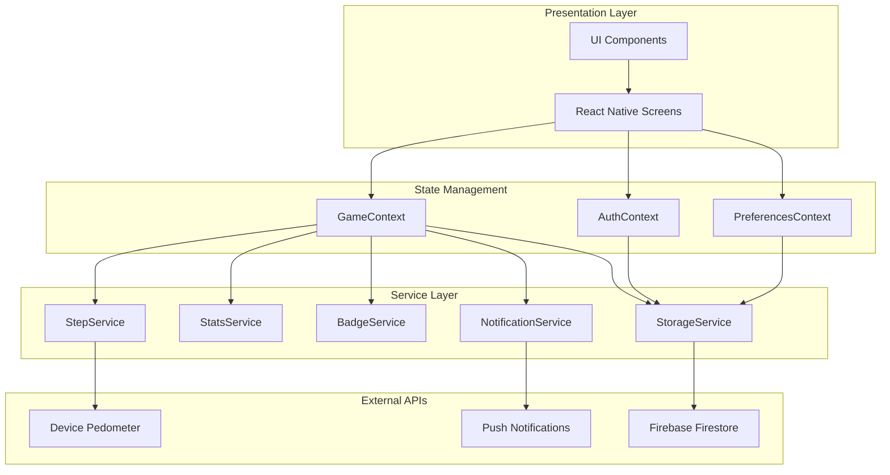
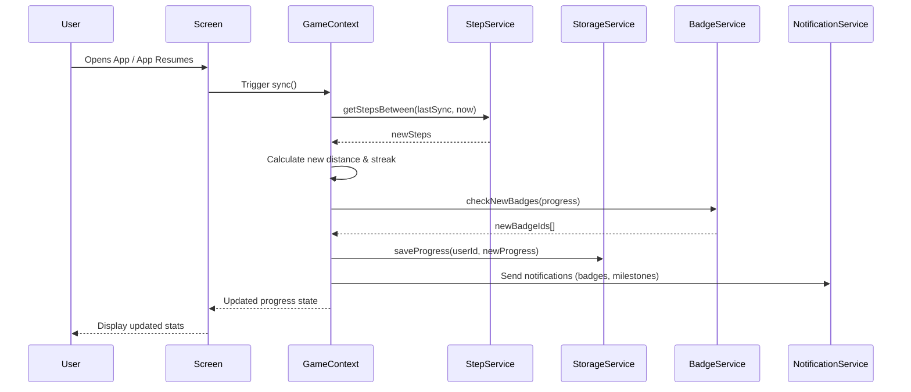
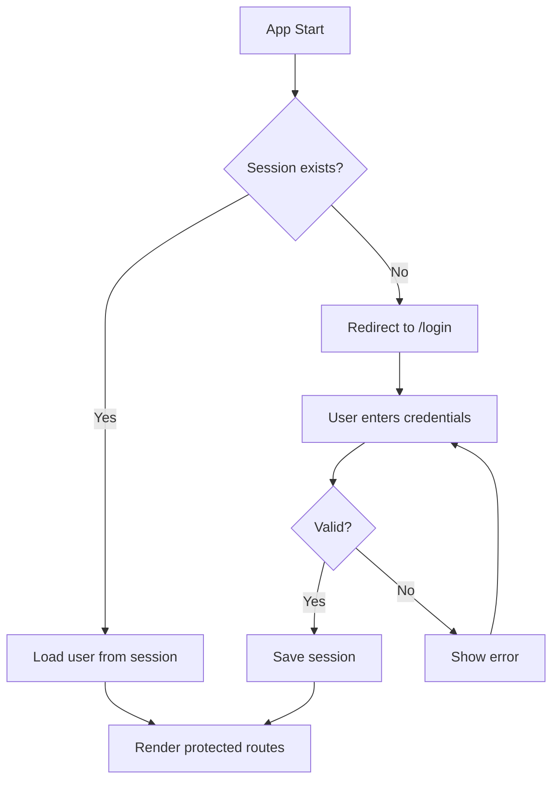
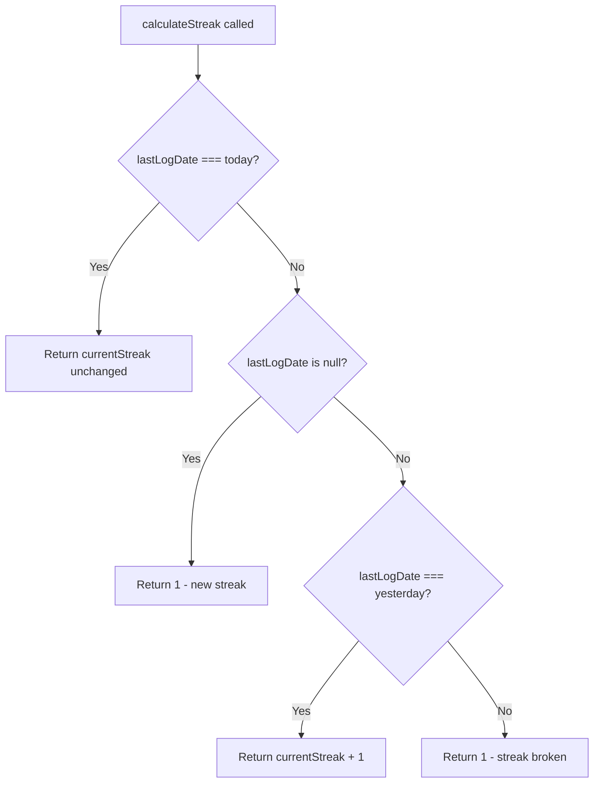
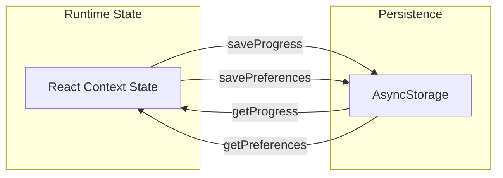

# Stridr - Technical Design Document

**Version:** 1.1  
**Last Updated:** January 15, 2026  
**Status:** Pre-Launch

---

## Table of Contents

1. [System Overview](#1-system-overview)
2. [Technology Stack](#2-technology-stack)
3. [Project Structure](#3-project-structure)
4. [State Management Architecture](#4-state-management-architecture)
5. [Service Layer](#5-service-layer)
6. [Data Models](#6-data-models)
7. [Navigation System](#7-navigation-system)
8. [Background Processing](#8-background-processing)
9. [Notification System](#9-notification-system)
10. [Storage Architecture](#10-storage-architecture)
11. [UI Component Library](#11-ui-component-library)
12. [Theming System](#12-theming-system)
13. [Algorithm Documentation](#13-algorithm-documentation)
14. [Security Considerations](#14-security-considerations)
15. [Testing Strategy](#15-testing-strategy)
16. [Build & Deployment](#16-build--deployment)
17. [API Reference](#17-api-reference)

---

## 1. System Overview

### 1.1 Architecture Diagram



### 1.2 Data Flow Overview



---

## 2. Technology Stack

### 2.1 Core Dependencies

| Package | Version | Purpose |
|---------|---------|---------|
| `expo` | ~54.0.31 | Development platform |
| `react` | 19.1.0 | UI framework |
| `react-native` | 0.81.5 | Native platform bridge |
| `typescript` | ~5.9.2 | Type safety |

### 2.2 Navigation & Routing

| Package | Version | Purpose |
|---------|---------|---------|
| `expo-router` | ~6.0.21 | File-based routing |
| `react-native-screens` | ~4.16.0 | Native screen optimization |
| `react-native-safe-area-context` | ~5.6.0 | Safe area handling |

### 2.3 Sensors & Device APIs

| Package | Version | Purpose |
|---------|---------|---------|
| `expo-sensors` | ~15.0.8 | Pedometer access |
| `expo-device` | ~8.0.10 | Device detection |
| `expo-image-picker` | ~17.0.10 | Photo selection |

### 2.4 Persistence & Storage

| Package | Version | Purpose |
|---------|---------|---------|
| `@react-native-async-storage/async-storage` | 2.2.0 | Local key-value storage |
| `firebase` | ^11.x | Cloud database & auth |

### 2.5 Notifications & Background

| Package | Version | Purpose |
|---------|---------|---------|
| `expo-notifications` | ^0.32.16 | Push notifications |
| `expo-background-fetch` | ~14.0.9 | Background tasks |
| `expo-task-manager` | ~14.0.9 | Task scheduling |

### 2.6 UI Libraries

| Package | Version | Purpose |
|---------|---------|---------|
| `lucide-react-native` | ^0.562.0 | Icon library |
| `react-native-svg` | ^15.12.1 | SVG rendering |
| `expo-linear-gradient` | ^15.0.8 | Gradient backgrounds |

---

## 3. Project Structure

```
Walking/
├── app/                           # Expo Router screens
│   ├── (tabs)/                    # Tab navigator group
│   │   ├── _layout.tsx            # Tab bar configuration
│   │   ├── index.tsx              # Home screen (762 lines)
│   │   ├── trails.tsx             # Trail selection
│   │   ├── progress.tsx           # Active trail progress
│   │   ├── achievements.tsx       # Badge collection
│   │   └── profile.tsx            # User profile
│   ├── trail/
│   │   └── [id].tsx               # Dynamic trail detail route
│   ├── _layout.tsx                # Root layout with providers
│   ├── login.tsx                  # Login screen
│   ├── signup.tsx                 # Registration screen
│   ├── edit-profile.tsx           # Profile editor
│   ├── my-dashboard.tsx           # Statistics dashboard
│   ├── notification-settings.tsx  # Notification preferences
│   └── legal.tsx                  # Legal documents viewer
│
├── src/
│   ├── context/                   # React Context providers
│   │   ├── AuthContext.tsx        # Authentication state (138 lines)
│   │   ├── GameContext.tsx        # Game logic & progress (378 lines)
│   │   └── PreferencesContext.tsx # User preferences (136 lines)
│   │
│   ├── services/                  # Business logic layer
│   │   ├── StepService.ts         # Pedometer abstraction (83 lines)
│   │   ├── StorageService.ts      # AsyncStorage wrapper (122 lines)
│   │   ├── BadgeService.ts        # Badge unlock logic (45 lines)
│   │   ├── StatsService.ts        # Statistics calculations (93 lines)
│   │   └── NotificationService.ts # Push notifications (256 lines)
│   │
│   ├── components/                # Reusable UI components
│   │   ├── DailyGoalRing.tsx      # Circular progress indicator
│   │   ├── DebugMenu.tsx          # Development tools
│   │   ├── NextLandmarkCard.tsx   # Landmark preview
│   │   ├── ProgressBar.tsx        # Linear progress bar
│   │   └── WeeklyActivityChart.tsx # 7-day bar chart
│   │
│   ├── const/                     # Static configuration
│   │   ├── trails.ts              # Trail definitions (419 lines)
│   │   ├── badges.ts              # Badge definitions (146 lines)
│   │   └── colors.ts              # Theme color palette (68 lines)
│   │
│   ├── types/                     # TypeScript interfaces
│   │   └── index.ts               # Global type definitions (74 lines)
│   │
│   └── utils/                     # Utility functions
│       └── conversion.ts          # Unit conversion helpers (59 lines)
│
├── assets/                        # Static assets
│   ├── icon.png                   # App icon
│   ├── adaptive-icon.png          # Android adaptive icon
│   ├── splash-icon.png            # Splash screen
│   └── trails/                    # Trail images
│
├── docs/                          # Documentation
│   ├── FUNCTIONAL_DESIGN_DOCUMENT.md
│   └── TECHNICAL_DESIGN_DOCUMENT.md
│
├── app.json                       # Expo configuration
├── package.json                   # Dependencies
├── tsconfig.json                  # TypeScript config
└── eas.json                       # EAS Build config
```

---

## 4. State Management Architecture

### 4.1 Context Provider Hierarchy

```tsx
// app/_layout.tsx - Provider nesting order
<SafeAreaProvider>
    <AuthProvider>           {/* Outermost - handles auth state */}
        <PreferencesProvider>    {/* User settings */}
            <GameProvider>           {/* Game logic - depends on Auth */}
                <Stack>              {/* Navigation */}
                    {screens}
                </Stack>
            </GameProvider>
        </PreferencesProvider>
    </AuthProvider>
</SafeAreaProvider>
```

### 4.2 AuthContext

**File:** `src/context/AuthContext.tsx`  
**Purpose:** Manages user authentication, registration, and session persistence.

```typescript
interface User {
    id: string;
    name: string;
    firstName?: string;
    lastName?: string;
    email: string;
    profileImage?: string;
}

interface AuthContextType {
    user: User | null;
    isLoading: boolean;
    login: (email: string, pass: string) => Promise<void>;
    register: (firstName: string, lastName: string, email: string, pass: string) => Promise<void>;
    logout: () => Promise<void>;
    updateProfile: (data: Partial<User>) => Promise<void>;
}
```

**Storage Keys:**
- `stridr_users_db` - Array of all registered users
- `stridr_current_session` - Currently logged-in user object

**Authentication Flow:**



### 4.3 GameContext

**File:** `src/context/GameContext.tsx`  
**Purpose:** Core game state management, step synchronization, and progress tracking.

```typescript
interface GameContextType {
    progress: UserProgress | null;
    isLoading: boolean;
    sync: () => Promise<void>;
    selectTrail: (trailId: string, days: number) => Promise<void>;
    extendTrail: (additionalDays: number) => Promise<void>;
    todaySteps: number;
    completedTrailsCount: number;
    debug?: {
        addSteps: (amount: number) => Promise<void>;
        setStreak: (days: number) => Promise<void>;
        resetProgress: () => Promise<void>;
        unlockAllBadges: () => Promise<void>;
    };
}
```

**Key Features:**
1. **Automatic Sync** - Hourly interval while app is active
2. **Foreground Sync** - Triggers when app resumes from background
3. **Trail Completion Detection** - Auto-resets progress on completion
4. **Notification Integration** - Sends badges, milestones, landmarks notifications
5. **Data Migration** - Handles legacy data formats

**Sync Algorithm:**

```typescript
sync() {
    1. Get lastSyncTime from progress
    2. Query StepService.getStepsBetween(lastSyncTime, now)
    3. If newSteps > 0:
        a. Calculate addedDistance = stepsToMeters(newSteps)
        b. Update totalStepsValid, currentDistanceMeters
        c. Calculate new streak using StatsService
        d. Check for trail completion
        e. Check for milestone notifications (25%, 50%, 75%, 100%)
        f. Check for landmark notifications
        g. Check for new badges via BadgeService
        h. Send notifications if enabled
        i. Persist to StorageService
    4. Update todaySteps from StepService
}
```

### 4.4 PreferencesContext

**File:** `src/context/PreferencesContext.tsx`  
**Purpose:** User preferences management with persistence.

```typescript
type DistanceUnit = 'km' | 'mi';
type Theme = 'light' | 'dark';
type ReminderTime = 'morning' | 'afternoon' | 'evening';

interface NotificationSettings {
    dailyReminder: boolean;
    dailyReminderTime: ReminderTime;
    goalAchievement: boolean;
    badgeUnlock: boolean;
    milestone: boolean;
    inactivityNudge: boolean;
    landmarkReached: boolean;
}

interface Preferences {
    distanceUnit: DistanceUnit;
    theme: Theme;
    dailyGoal: number;
    notificationsEnabled: boolean;
    notificationSettings: NotificationSettings;
    strideLength: number; // in cm
}

// Default values
const defaultPreferences: Preferences = {
    distanceUnit: 'km',
    theme: 'light',
    dailyGoal: 10000,
    notificationsEnabled: true,
    notificationSettings: { /* all enabled */ },
    strideLength: 75,
};
```

---

## 5. Service Layer

### 5.1 StepService

**File:** `src/services/StepService.ts`  
**Purpose:** Abstraction layer for device pedometer access.

```typescript
export const StepService = {
    // Check if pedometer hardware is available
    async isAvailable(): Promise<boolean>
    
    // Request motion/fitness permissions
    async requestPermissions(): Promise<boolean>
    
    // Get steps in a date range
    async getStepsBetween(start: Date, end: Date): Promise<number>
    
    // Get today's step count (midnight to now)
    async getTodaySteps(): Promise<number>
    
    // Get historical daily step counts
    async getDailyHistory(days: number): Promise<{ date: string; steps: number }[]>
}
```

**Implementation Details:**
- Uses `expo-sensors` Pedometer API
- Queries device's CMPedometer (iOS) or SensorManager (Android)
- Returns 0 on permission denial or errors (graceful degradation)

### 5.2 StorageService

**File:** `src/services/StorageService.ts`  
**Purpose:** Centralized persistence layer using AsyncStorage.

```typescript
export const StorageService = {
    // User progress (per-user)
    async saveProgress(userId: string, progress: UserProgress): Promise<void>
    async getProgress(userId: string): Promise<UserProgress>
    
    // Daily step logs (per-user)
    async saveDailyLog(userId: string, log: DailyLog): Promise<void>
    async getDailyLogs(userId: string): Promise<DailyLog[]>
    
    // Global preferences
    async savePreferences(preferences: any): Promise<void>
    async getPreferences(): Promise<any | null>
    
    // Current user ID (for background tasks)
    async saveCurrentUserId(userId: string): Promise<void>
    async getCurrentUserId(): Promise<string | null>
    async clearCurrentUserId(): Promise<void>
}
```

**Storage Key Patterns:**

| Key Pattern | Scope | Data |
|-------------|-------|------|
| `stridr_user_progress_{userId}` | Per-user | UserProgress object |
| `stridr_daily_logs_{userId}` | Per-user | DailyLog[] array |
| `stridr_preferences` | Global | Preferences object |
| `stridr_current_user_id` | Global | Current user's ID |
| `stridr_users_db` | Global | User[] array |
| `stridr_current_session` | Global | Current User object |

### 5.3 BadgeService

**File:** `src/services/BadgeService.ts`  
**Purpose:** Monthly recurring badge system with step, distance, and trail badges.

```typescript
export const BadgeService = {
    // Monthly badge checks
    checkMonthlyStepBadges(steps: number, alreadyUnlocked: string[]): string[]
    checkMonthlyDistanceBadges(distance: number, alreadyUnlocked: string[]): string[]
    checkAllMonthlyBadges(monthlyProgress: MonthlyProgress): string[]
    
    // Super badges
    checkMonthlyMaster(monthlyProgress: MonthlyProgress): boolean
    checkYearlyChampion(yearlyProgress: YearlyProgress): boolean
    
    // Lifetime badges
    checkTrailBadges(completedCount: number, totalTrails: number, alreadyUnlocked: string[]): string[]
    
    // Helpers
    getNextBadges(monthlyProgress: MonthlyProgress): NextBadgeInfo[]
    getBadgesRemainingForMonthly(monthlyProgress: MonthlyProgress): number
    createNewMonthlyProgress(year: number, month: number): MonthlyProgress
}
```

**Badge Condition Types:**

| Type | Evaluation |
|------|------------|
| `MONTHLY_STEPS` | `monthlyProgress.stepsThisMonth >= conditionValue` |
| `MONTHLY_DISTANCE` | `monthlyProgress.distanceMetersThisMonth >= conditionValue` |
| `TRAILS_COMPLETED` | `stats.completedTrailsCount >= conditionValue` |
| `MONTHLY_MASTER` | `monthlyProgress.unlockedBadgeIds.length >= 10` |
| `YEARLY_CHAMPION` | `yearlyProgress.monthlyBadgesEarned.length >= 12` |

**Badge Condition Types:**

| Type | Evaluation |
|------|------------|
| `TOTAL_STEPS` | `progress.totalStepsValid >= conditionValue` |
| `TOTAL_DISTANCE` | `progress.currentDistanceMeters >= conditionValue` |
| `STREAK` | `progress.currentStreak >= conditionValue` |
| `TRAIL_COMPLETE` | Checked separately on trail completion |
| `SEASON` | Time-based (not yet implemented) |
| `MONTH` | Time-based (not yet implemented) |

### 5.4 StatsService

**File:** `src/services/StatsService.ts`  
**Purpose:** Statistical calculations for streaks and trail completion.

```typescript
export const StatsService = {
    /**
     * Calculates updated streak based on activity dates.
     * Streak increments if logged yesterday, resets to 1 otherwise.
     */
    calculateStreak(
        currentStreak: number, 
        lastLogDate: string | null, 
        now: Date
    ): number
    
    /**
     * Checks if trail is completed and generates completion stats.
     * Returns null if not completed or already recorded.
     */
    checkTrailCompletion(
        progress: UserProgress,
        trail: Trail,
        now: Date,
        dailyLogs: DailyLog[]
    ): CompletedTrail | null
}
```

**Streak Calculation Logic:**



### 5.5 NotificationService

**File:** `src/services/NotificationService.ts`  
**Purpose:** Push notification scheduling and delivery.

```typescript
export const NotificationService = {
    // Permissions
    async requestPermissions(): Promise<boolean>
    
    // Scheduled Notifications
    async scheduleDailyReminder(time: ReminderTime): Promise<string | null>
    async cancelDailyReminder(): Promise<void>
    
    // Immediate Notifications
    async sendGoalAchievement(goal: number): Promise<void>
    async sendBadgeUnlock(badgeName: string, icon: string): Promise<void>
    async sendMilestone(percent: number, trailName: string): Promise<void>
    async sendLandmarkReached(landmarkName: string): Promise<void>
    async sendInactivityNudge(daysSinceLastWalk: number): Promise<void>
    
    // Background Tasks
    async registerInactivityCheck(): Promise<void>
    async unregisterInactivityCheck(): Promise<void>
    async checkInactivityAndNotify(): Promise<void>
}
```

**Reminder Time Presets:**

| Key | Hour | Display |
|-----|------|---------|
| `morning` | 9 | 9:00 AM |
| `afternoon` | 14 | 2:00 PM |
| `evening` | 18 | 6:00 PM |

---

## 6. Data Models

### 6.1 Trail

```typescript
interface Trail {
    id: string;                    // Unique identifier (e.g., 'roopkund-trek')
    name: string;                  // Display name
    description: string;           // Short description
    extendedDescription?: string;  // Detailed description
    totalDistanceMeters: number;   // Total trail distance
    image: any;                    // require() image reference
    color: string;                 // Theme color hex code
    difficulty: 'Easy' | 'Moderate' | 'Hard' | 'Extreme';
    landmarks: Landmark[];         // Array of checkpoints
    startCoordinate?: { latitude: number; longitude: number };
    endCoordinate?: { latitude: number; longitude: number };
    region?: {
        latitude: number;
        longitude: number;
        latitudeDelta: number;
        longitudeDelta: number;
    };
}
```

### 6.2 Landmark

```typescript
interface Landmark {
    id: string;              // Unique identifier within trail
    name: string;            // Location name
    distanceMeters: number;  // Distance from trail start to unlock
    description: string;     // Location description
    image?: any;             // Optional image
    coordinate?: { latitude: number; longitude: number };
}
```

### 6.3 UserProgress

```typescript
interface UserProgress {
    // Active Trail
    selectedTrailId: string | null;
    trailStartDate: string | null;    // ISO Date
    targetDays: number;               // User's goal duration
    
    // Progress Tracking
    totalStepsValid: number;          // Steps counted toward current trail
    currentDistanceMeters: number;    // Distance covered on current trail
    
    // Sync State
    lastSyncTime: string;             // ISO Date String
    
    // Lifetime Stats
    stats: {
        totalStepsLifetime: number;
        totalDistanceMetersLifetime: number;
        completedTrailsCount: number;
    };
    
    // Monthly Badge System
    monthlyProgress: MonthlyProgress;  // Current month badges
    yearlyProgress: YearlyProgress[];  // History of yearly progress
    trailBadges: string[];             // Lifetime trail completion badges
    
    // Trail History
    completedTrails: CompletedTrail[];
    currentStreak: number;
    lastLogDate: string | null;       // YYYY-MM-DD format
}

interface MonthlyProgress {
    year: number;
    month: number;
    stepsThisMonth: number;
    distanceMetersThisMonth: number;
    unlockedBadgeIds: string[];
    monthlyBadgeEarned: boolean;
}

interface YearlyProgress {
    year: number;
    monthlyBadgesEarned: number[];  // Array of months (1-12)
    yearlyBadgeEarned: boolean;
}
```

### 6.4 CompletedTrail

```typescript
interface CompletedTrail {
    trailId: string;
    completedDate: string;      // ISO Date
    startDate: string;          // ISO Date
    totalSteps: number;
    totalDays: number;          // Duration in days
    avgStepsPerDay: number;
    maxStepsInOneDay: number;
}
```

### 6.5 DailyLog

```typescript
interface DailyLog {
    date: string;          // YYYY-MM-DD format
    steps: number;
    distanceMeters: number;
}
```

### 6.6 Badge

```typescript
interface Badge {
    id: string;                  // Unique identifier
    name: string;                // Display name
    description: string;         // Description (e.g., "Walk 5,000 steps this month")
    icon: string;                // Emoji icon
    conditionType: 'MONTHLY_STEPS' | 'MONTHLY_DISTANCE' | 'TRAILS_COMPLETED' | 
                   'MONTHLY_MASTER' | 'YEARLY_CHAMPION';
    conditionValue: number;      // Threshold value
    collection: string;          // Collection ID for grouping
}
```

### 6.7 MonthlyProgress

```typescript
interface MonthlyProgress {
    year: number;                    // e.g., 2026
    month: number;                   // 1-12
    stepsThisMonth: number;          // Accumulated steps this month
    distanceMetersThisMonth: number; // Accumulated distance this month
    unlockedBadgeIds: string[];      // Monthly badges earned
    monthlyBadgeEarned: boolean;     // Has earned Monthly Master
}
```

---

## 7. Navigation System

### 7.1 Route Structure

```
/                           → Redirects to /(tabs) or /login
├── (tabs)/                 → Tab Navigator
│   ├── index              → Home Screen
│   ├── trails             → Trail List
│   ├── progress           → Active Trail Progress
│   ├── achievements       → Badge Collection
│   └── profile            → User Profile & Settings
├── trail/[id]             → Dynamic Trail Detail
├── login                  → Login Screen
├── signup                 → Registration Screen
├── edit-profile           → Profile Editor
├── my-dashboard           → Statistics Dashboard
├── notification-settings  → Notification Preferences
├── legal                  → Privacy Policy & Terms
└── preferences            → App Settings (planned)
```

### 7.2 Protected Route Logic

```typescript
// app/_layout.tsx - ProtectedLayout component
useEffect(() => {
    if (isLoading) return;
    
    const inAuthGroup = segments[0] === 'login' || segments[0] === 'signup';
    
    if (!user && !inAuthGroup) {
        router.replace('/login');
    } else if (user && inAuthGroup) {
        router.replace('/(tabs)');
    }
}, [user, isLoading, segments]);
```

### 7.3 Tab Configuration

```typescript
// app/(tabs)/_layout.tsx
<Tabs screenOptions={{
    tabBarActiveTintColor: '#10B981',  // Emerald green
    headerShown: false,
}}>
    <Tabs.Screen name="index" options={{ title: 'Home', tabBarIcon: House }} />
    <Tabs.Screen name="trails" options={{ title: 'Trails', tabBarIcon: Map }} />
    <Tabs.Screen name="progress" options={{ title: 'Progress', tabBarIcon: TrendingUp }} />
    <Tabs.Screen name="achievements" options={{ title: 'Badges', tabBarIcon: Award }} />
    <Tabs.Screen name="profile" options={{ title: 'Profile', tabBarIcon: User }} />
</Tabs>
```

---

## 8. Background Processing

### 8.1 App State Sync

The app automatically syncs step data when:
1. **Initial Load** - When GameContext mounts with an active trail
2. **Hourly Interval** - Every 60 minutes while app is active
3. **App Resume** - When app returns from background

```typescript
// GameContext.tsx - Foreground sync
useEffect(() => {
    const subscription = AppState.addEventListener('change', (nextAppState) => {
        if (nextAppState === 'active') {
            sync();
        }
    });
    
    return () => subscription.remove();
}, [user, progress?.selectedTrailId]);

// Hourly sync interval
useEffect(() => {
    const syncInterval = setInterval(() => {
        sync();
    }, 60 * 60 * 1000); // 1 hour
    
    return () => clearInterval(syncInterval);
}, [user, progress?.selectedTrailId]);
```

### 8.2 Background Fetch Task

```typescript
// NotificationService.ts
const INACTIVITY_CHECK_TASK = 'INACTIVITY_CHECK_TASK';

// Register task
await BackgroundFetch.registerTaskAsync(INACTIVITY_CHECK_TASK, {
    minimumInterval: 60 * 60 * 24, // Once per day
    stopOnTerminate: false,
    startOnBoot: true,
});

// Task definition
TaskManager.defineTask(INACTIVITY_CHECK_TASK, async () => {
    await NotificationService.checkInactivityAndNotify();
    return BackgroundFetch.BackgroundFetchResult.NewData;
});
```

---

## 9. Notification System

### 9.1 Notification Types

| Type | Trigger | Title | Example Body |
|------|---------|-------|--------------|
| Daily Reminder | Scheduled time | ⏰ Time for your daily walk! | Every step counts... |
| Goal Achievement | Daily goal reached | 🎉 Goal Achieved! | You've hit your 10,000 step goal! |
| Badge Unlock | Badge earned | 👶 New Badge Unlocked! | You earned "Baby Steps"! |
| Milestone | 25/50/75/100% trail | 🎯 Trail Milestone! | You've reached 50% of Roopkund! |
| Landmark Reached | Distance threshold | 📍 Landmark Reached! | You've arrived at Lohajung! |
| Inactivity Nudge | 3+ days inactive | 👋 We miss you! | It's been 5 days since... |

### 9.2 Android Channel Configuration

```typescript
await Notifications.setNotificationChannelAsync('default', {
    name: 'default',
    importance: Notifications.AndroidImportance.MAX,
    vibrationPattern: [0, 250, 250, 250],
    lightColor: '#FF231F7C',
});
```

### 9.3 Notification Handler

```typescript
Notifications.setNotificationHandler({
    handleNotification: async () => ({
        shouldShowAlert: true,
        shouldPlaySound: true,
        shouldSetBadge: false,
        shouldShowBanner: true,
        shouldShowList: true,
    }),
});
```

---

## 10. Storage Architecture

### 10.1 Storage Keys Reference

| Key | Type | Description |
|-----|------|-------------|
| `stridr_users_db` | `User[]` | All registered user accounts |
| `stridr_current_session` | `User` | Currently authenticated user |
| `stridr_user_progress_{userId}` | `UserProgress` | User's game progress |
| `stridr_daily_logs_{userId}` | `DailyLog[]` | Historical step data |
| `stridr_preferences` | `Preferences` | App settings |
| `stridr_current_user_id` | `string` | User ID for background tasks |

### 10.2 Data Persistence Flow



### 10.3 Initial Progress State

```typescript
const INITIAL_PROGRESS: UserProgress = {
    selectedTrailId: null,
    trailStartDate: null,
    targetDays: 7,
    totalStepsValid: 0,
    currentDistanceMeters: 0,
    lastSyncTime: new Date().toISOString(),
    unlockedBadges: [],
    currentStreak: 0,
    lastLogDate: null,
    completedTrails: [],
};
```

---

## 11. UI Component Library

### 11.1 Component Overview

| Component | File | Purpose |
|-----------|------|---------|
| `DailyGoalRing` | DailyGoalRing.tsx | Circular progress indicator for daily steps |
| `ProgressBar` | ProgressBar.tsx | Linear trail completion progress |
| `WeeklyActivityChart` | WeeklyActivityChart.tsx | 7-day step history bar chart |
| `NextLandmarkCard` | NextLandmarkCard.tsx | Upcoming landmark preview |
| `DebugMenu` | DebugMenu.tsx | Development testing tools |

### 11.2 DailyGoalRing Props

```typescript
interface DailyGoalRingProps {
    current: number;       // Current step count
    goal: number;          // Daily goal
    size?: number;         // Ring diameter
    strokeWidth?: number;  // Ring thickness
}
```

### 11.3 WeeklyActivityChart Props

```typescript
interface WeeklyActivityChartProps {
    data: { date: string; steps: number }[];  // 7-day history
    height?: number;                           // Chart height
}
```

---

## 12. Theming System

### 12.1 Color Palette

**File:** `src/const/colors.ts`

```typescript
export const Colors = {
    light: {
        background: '#F9FAFB',
        backgroundSecondary: '#FFFFFF',
        backgroundTertiary: '#F3F4F6',
        text: '#111827',
        textSecondary: '#6B7280',
        textTertiary: '#9CA3AF',
        textInverse: '#FFFFFF',
        border: '#E5E7EB',
        divider: '#F3F4F6',
        card: '#FFFFFF',
        cardSecondary: '#F9FAFB',
        handle: '#E5E7EB',
        shadow: '#000000',
        statusBar: 'dark-content',
    },
    dark: {
        background: '#111827',
        backgroundSecondary: '#1F2937',
        backgroundTertiary: '#374151',
        text: '#F9FAFB',
        textSecondary: '#D1D5DB',
        textTertiary: '#9CA3AF',
        textInverse: '#111827',
        border: '#374151',
        divider: '#1F2937',
        card: '#1F2937',
        cardSecondary: '#111827',
        handle: '#4B5563',
        shadow: '#000000',
        statusBar: 'light-content',
    }
};
```

### 12.2 Theme Hook

```typescript
// Usage in components
export const useTheme = () => {
    const { preferences } = usePreferences();
    const { Colors } = require('../const/colors');
    return Colors[preferences.theme];
};

// Example
const theme = useTheme();
<View style={{ backgroundColor: theme.background }}>
    <Text style={{ color: theme.text }}>Hello</Text>
</View>
```

---

## 13. Algorithm Documentation

### 13.1 Steps to Distance Conversion

```typescript
// src/utils/conversion.ts
export const AVG_STRIDE_LENGTH_METERS = 0.762; // ~2.5 feet

export function stepsToMeters(steps: number): number {
    return steps * AVG_STRIDE_LENGTH_METERS;
}
```

**Calculation:**
- Average stride length: 0.762 meters (configurable via preferences)
- 10,000 steps ≈ 7,620 meters ≈ 7.62 km ≈ 4.73 miles

### 13.2 Streak Calculation Algorithm

```typescript
calculateStreak(currentStreak, lastLogDate, now) {
    const todayStr = formatDate(now);  // YYYY-MM-DD
    
    // Already logged today - no change
    if (lastLogDate === todayStr) return currentStreak;
    
    // No previous log - start new streak
    if (!lastLogDate) return 1;
    
    const yesterdayStr = formatDate(yesterday);
    
    // Logged yesterday - continue streak
    if (lastLogDate === yesterdayStr) return currentStreak + 1;
    
    // Gap in logging - reset streak
    return 1;
}
```

### 13.3 Trail Completion Detection

```typescript
checkTrailCompletion(progress, trail, now, dailyLogs) {
    // Not complete yet
    if (progress.currentDistanceMeters < trail.totalDistanceMeters) {
        return null;
    }
    
    // Already recorded
    if (progress.completedTrails.some(ct => ct.trailId === trail.id)) {
        return null;
    }
    
    // Calculate stats
    const duration = daysBetween(progress.trailStartDate, now);
    const avgSteps = progress.totalStepsValid / duration;
    const maxSteps = Math.max(...relevantLogs.map(l => l.steps));
    
    return {
        trailId: trail.id,
        completedDate: now.toISOString(),
        startDate: progress.trailStartDate,
        totalSteps: progress.totalStepsValid,
        totalDays: duration,
        avgStepsPerDay: avgSteps,
        maxStepsInOneDay: maxSteps
    };
}
```

### 13.4 Milestone Detection

```typescript
// In GameContext sync()
const prevPercent = Math.floor(
    (oldDistance / trailTotalDistance) * 100
);
const newPercent = Math.floor(
    (newDistance / trailTotalDistance) * 100
);

const milestones = [25, 50, 75];
for (const milestone of milestones) {
    if (prevPercent < milestone && newPercent >= milestone) {
        await NotificationService.sendMilestone(milestone, trailName);
        break;  // Only one notification per sync
    }
}
```

---

## 14. Security Considerations

### 14.1 Data Storage

| Aspect | Implementation | Notes |
|--------|----------------|-------|
| User passwords | Stored in AsyncStorage (plaintext) | MVP only - use secure auth for production |
| Session tokens | AsyncStorage | Cleared on logout |
| Personal data | Device-local only | No cloud transmission |
| Data encryption | None (OS-level only) | AsyncStorage is sandboxed |

### 14.2 Permission Handling

```typescript
// StepService - graceful permission handling
async requestPermissions(): Promise<boolean> {
    const { status } = await Pedometer.requestPermissionsAsync();
    return status === 'granted';
}

// All pedometer queries return 0 on permission denial
async getStepsBetween(start, end): Promise<number> {
    try {
        const result = await Pedometer.getStepCountAsync(start, end);
        return result.steps;
    } catch (error) {
        console.warn('Pedometer query failed', error);
        return 0;  // Graceful fallback
    }
}
```

### 14.3 Required Permissions

**iOS (Info.plist):**
```json
{
    "NSMotionUsageDescription": "Stridr uses your step count to track your progress on virtual trails.",
    "NSPhotoLibraryUsageDescription": "Stridr needs access to your photos to let you update your profile picture.",
    "NSCameraUsageDescription": "Stridr needs access to your camera to let you take a profile picture."
}
```

**Android (AndroidManifest.xml):**
```xml
<uses-permission android:name="android.permission.RECEIVE_BOOT_COMPLETED" />
<uses-permission android:name="android.permission.WAKE_LOCK" />
```

---

## 15. Testing Strategy

### 15.1 Test Configuration

**File:** `jest.config.js`

```javascript
module.exports = {
    preset: 'jest-expo',
    setupFilesAfterEnv: ['<rootDir>/__mocks__/setup.js'],
    transformIgnorePatterns: [
        'node_modules/(?!((jest-)?react-native|@react-native(-community)?)|expo(nent)?|@expo(nent)?/.*|@expo-google-fonts/.*|react-navigation|@react-navigation/.*|@unimodules/.*|unimodules|sentry-expo|native-base|react-native-svg)'
    ],
};
```

### 15.2 Service Tests

**BadgeService Tests:** `src/services/BadgeService.test.ts`

```typescript
describe('BadgeService', () => {
    it('unlocks step badges at correct thresholds', () => {
        const progress = { totalStepsValid: 1000, unlockedBadges: [] };
        const newBadges = BadgeService.checkNewBadges(progress);
        expect(newBadges).toContain('warrior-1'); // Baby Steps
    });
});
```

**StatsService Tests:** `src/services/StatsService.test.ts`

```typescript
describe('StatsService.calculateStreak', () => {
    it('returns 1 when no previous log exists', () => {
        const streak = StatsService.calculateStreak(0, null, new Date());
        expect(streak).toBe(1);
    });
    
    it('increments streak when logged yesterday', () => {
        const yesterday = /* ... */;
        const streak = StatsService.calculateStreak(5, yesterday, new Date());
        expect(streak).toBe(6);
    });
});
```

### 15.3 Debug Tools

**File:** `src/components/DebugMenu.tsx`

Available debug actions:
- **Add Steps** - Manually add step count for testing
- **Set Streak** - Override current streak value
- **Unlock All Badges** - Instantly unlock all badges
- **Reset Progress** - Clear all user progress
- **Test Notifications** - Trigger each notification type

---

## 16. Build & Deployment

### 16.1 Expo Configuration

**File:** `app.json`

```json
{
    "expo": {
        "name": "Stridr",
        "slug": "Stridr",
        "version": "1.0.0",
        "scheme": "stridr",
        "orientation": "portrait",
        "ios": {
            "supportsTablet": true,
            "bundleIdentifier": "com.newrishav.stridr"
        },
        "android": {
            "package": "com.newrishav.stridr",
            "adaptiveIcon": { /* ... */ }
        },
        "plugins": [
            "expo-router",
            "expo-notifications",
            "expo-background-fetch"
        ]
    }
}
```

### 16.2 EAS Build Configuration

**File:** `eas.json`

```json
{
    "cli": { "version": ">= 3.0.0" },
    "build": {
        "development": {
            "developmentClient": true,
            "distribution": "internal"
        },
        "preview": {
            "distribution": "internal"
        },
        "production": {}
    },
    "submit": {
        "production": {}
    }
}
```

### 16.3 Build Commands

```bash
# Development build
eas build --profile development --platform ios
eas build --profile development --platform android

# Preview (internal testing)
eas build --profile preview --platform android

# Production build
eas build --platform ios
eas build --platform android

# Submit to stores
eas submit --platform ios
eas submit --platform android
```

---

## 17. API Reference

### 17.1 Context Hooks

```typescript
// Authentication
const { user, isLoading, login, register, logout, updateProfile } = useAuth();

// Game State
const { progress, sync, selectTrail, extendTrail, todaySteps, debug } = useGame();

// User Preferences
const { 
    preferences, 
    setDistanceUnit, 
    setTheme, 
    setDailyGoal,
    setNotificationsEnabled,
    updateNotificationSetting 
} = usePreferences();

// Theme Colors
const theme = useTheme();  // Returns Colors.light or Colors.dark
```

### 17.2 Utility Functions

```typescript
// Distance conversion (src/utils/conversion.ts)
stepsToMeters(steps: number): number
metersToKm(meters: number): number
metersToMiles(meters: number): number
formatDistance(meters: number, unit: 'km' | 'mi', decimals?: number): string
getDistanceValue(meters: number, unit: 'km' | 'mi'): number
getDistanceUnit(unit: 'km' | 'mi'): string
formatBadgeDistance(meters: number, unit: 'km' | 'mi'): string
```

### 17.3 Service Methods Quick Reference

```typescript
// StepService
StepService.isAvailable(): Promise<boolean>
StepService.requestPermissions(): Promise<boolean>
StepService.getStepsBetween(start: Date, end: Date): Promise<number>
StepService.getTodaySteps(): Promise<number>
StepService.getDailyHistory(days: number): Promise<DailyLog[]>

// StorageService
StorageService.saveProgress(userId, progress): Promise<void>
StorageService.getProgress(userId): Promise<UserProgress>
StorageService.saveDailyLog(userId, log): Promise<void>
StorageService.getDailyLogs(userId): Promise<DailyLog[]>
StorageService.savePreferences(prefs): Promise<void>
StorageService.getPreferences(): Promise<any>

// BadgeService
BadgeService.checkNewBadges(progress): string[]

// StatsService
StatsService.calculateStreak(streak, lastLogDate, now): number
StatsService.checkTrailCompletion(progress, trail, now, logs): CompletedTrail | null

// NotificationService
NotificationService.requestPermissions(): Promise<boolean>
NotificationService.scheduleDailyReminder(time): Promise<string | null>
NotificationService.cancelDailyReminder(): Promise<void>
NotificationService.sendGoalAchievement(goal): Promise<void>
NotificationService.sendBadgeUnlock(name, icon): Promise<void>
NotificationService.sendMilestone(percent, trailName): Promise<void>
NotificationService.sendLandmarkReached(name): Promise<void>
NotificationService.sendInactivityNudge(days): Promise<void>
```

---

*This document provides comprehensive technical specifications for the Stridr v1.0.0 application.*
